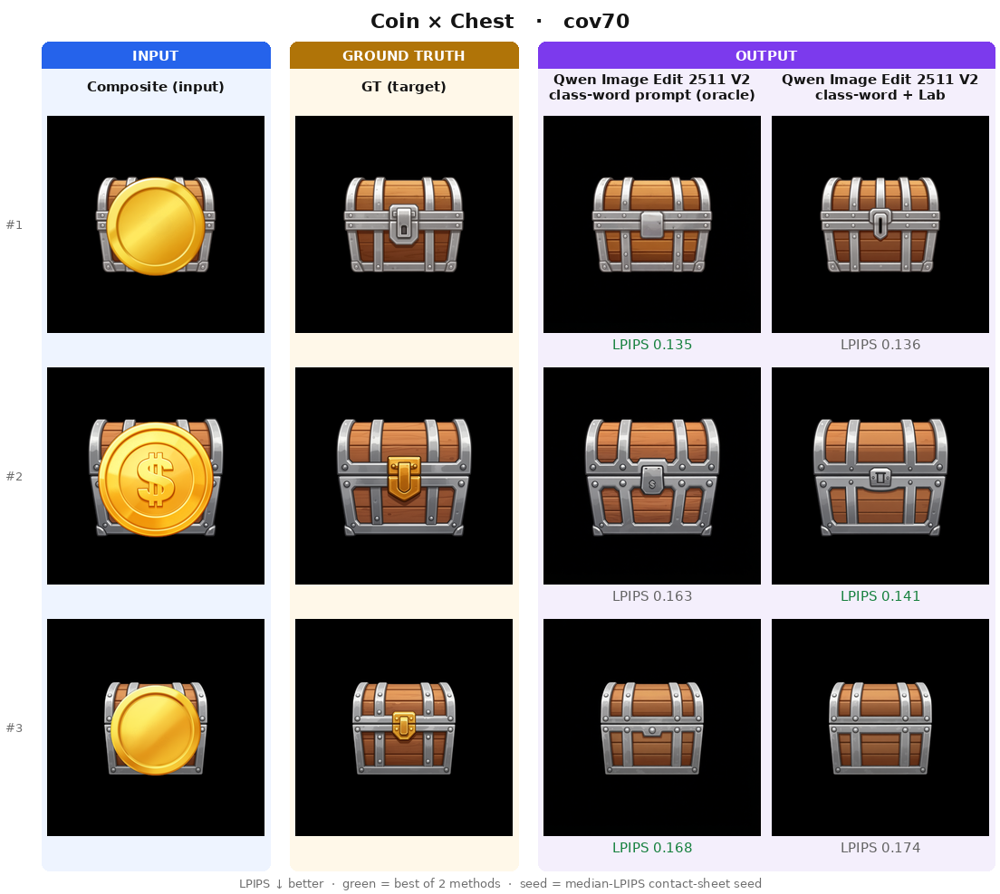
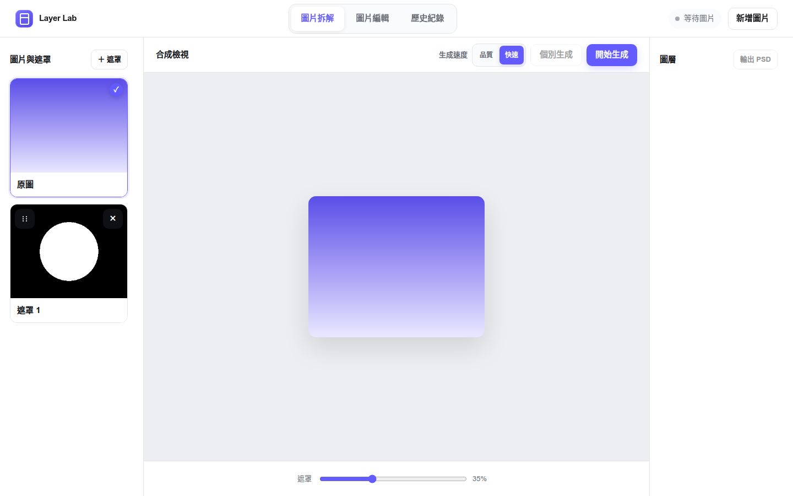

# 非寫實 2D 圖像之前景移除與遮擋區域補全

### Foreground Removal and Amodal Completion for Non-Photorealistic 2D Graphics

**問題：**移除前景之後，如何補回被遮住的**特定後景部件**，並維持身份、外觀、幾何、位置與畫風？

**研究做法：**以非寫實遊戲 UI／人物插圖為對象，建立模型與提示詞 baseline，比較區域引導與 NoiseMask 等設定，以合成 benchmark 和逐層評估檢查補全結果，再將功能整合到 Layer Lab。

**Qualitative result：**下圖比較同一提示詞加入 NoiseMask 前後的寶箱補全。

*Qwen Image Edit 2511 Prompt V2 → 同提示詞 + NoiseMask 3%。[圖像選取、oracle inputs 與評估範圍](docs/evaluation.md#readme-figure-reading-note) · [全部配對與 all-seed 圖](docs/qualitative_results.md)*

**Abstract.** This research studies foreground removal and identity-specific amodal completion for non-photorealistic 2D graphics through controlled comparisons of conditioning and region preservation. This archive retains positive, negative, inconclusive, and diagnostic evidence. Automatic metrics, human review, and system usability support distinct claims.

## 研究問題

Amodal completion 補的是原本被遮擋的特定部件，並非任意合理的背景。品質分別看前景是否真正移除、指定後景是否補對、非編輯區域是否維持。長期目標是可獨立使用的 RGBA 部件；歷史實驗的實際 input／output／proxy 在各頁記錄。

## 研究脈絡與 Current Research Understanding

Baseline 分出 BBox、NoiseMask、attention、structure、flow 與 QA 分支。部分 bounded screen 得到負結果，部分只有機制診斷，部分缺正式品質證據；NoiseMask 的較佳 automatic metrics 也不等於真實美術普遍有效。

[研究時間軸與分支圖](docs/experiments/00_research_timeline.md) · [Current Research Pipeline](docs/current_pipeline.md)

## 主要實驗

| Experiment | Execution | Evidence | Conclusion | Adoption |
|---|---|---|---|---|
| [Prompt 與模型 baseline](docs/experiments/01_baselines.md) | Generation Completed | Automatic Metrics; partial Human QA | Inconclusive | Historical |
| [BBox 與區域資訊](docs/experiments/02_region_guidance.md) | Generation Completed | Automatic Metrics | Negative under tested metric conditions | Not Adopted |
| [NoiseMask 與輸入消融](docs/experiments/03_noise_mask.md) | Generation Completed; parent matrix Partially Run | Automatic Metrics; matched Human QA pending | Positive under tested automatic metrics | Current for Qwen class-word V2 contract |
| [Attention 干預與診斷](docs/experiments/04_attention_control.md) | Generation Completed for screens; RQ3 Implemented | Partial Evidence; Automatic Metrics; diagnostic traces | Negative for bounded screens; Diagnostic Only for traces; Inconclusive for RQ3 | Not Adopted / Experimental |
| [Matched structure reference](docs/experiments/05_structure_guidance.md) | Implemented; formal Not Run in audited evidence | CPU geometry viability only | Inconclusive | Experimental |
| [Flow guidance 與 FlowEdit transport](docs/experiments/06_flow_editing.md) | Generation Completed for step-window; RQ1 Implemented | Operator QA for bounded pilot; RQ1 Missing Required Evidence | Negative for tested step-window; Inconclusive for RQ1 | Not Adopted / Experimental |
| [VLM QA、selection 與 retry](docs/experiments/07_vlm_qa.md) | Generation Completed for frozen replay | Operator labels and matched diagnostic comparison | Negative for replacement decision; Diagnostic Only for selector gains | Retain V3; V7 Not Adopted |
| [Benchmark、chained evaluation 與 steps](docs/experiments/08_evaluation.md) | Generation Completed for chained and steps | Automatic Metrics; incomplete stage-level QA | Inconclusive | Current evaluation practice; quality pending |

## Quantitative Evaluation

### Synthetic Benchmark

目前 Synth V2 公開整理包含 30 experimental configurations × 27 samples × 5 seeds 的 4,050 筆分數。Configurations 包括模型、prompt、mask 與 parameter variants，不代表 30 個獨立研究方法。下表只比較 matched Prompt V2 pair，使用 9-class macro，不能與其他資料／metric scope 直接排名。

| Qwen Image Edit 2511 / oracle inputs | LPIPS ↓ | PSNR ↑ | SSIM ↑ |
|---|---:|---:|---:|
| Class-word Prompt V2 | 0.070 | 25.51 | 0.892 |
| Same prompt + Lab NoiseMask 3% | 0.055 | 26.40 | 0.913 |

這是 automatic evidence；新增 paired QA tuples 仍 pending。[完整分層表](assets/results/paired/table.md) · [逐 seed 分數](assets/results/synthetic_v2/scores.csv) · [評估契約與限制](docs/evaluation.md)

另保存 [Synthetic V3 chained comparison](docs/experiments/08_evaluation.md)，獨立呈現 Stage 1／Stage 2 reveal-region 表，不與 V2 object-centric 指標混排。

### Private Industry Dataset

企業合作資料只公開經篩選的 aggregate quantitative results；不公開原圖、result image、mask、crop、個別 case、內部 metadata 或合作企業名稱。[整體量化結果與限制](docs/industry_aggregate_results.md)包含 QA frozen replay、steps comparison 與 Flow 診斷；不改變原有研究結論。

## Standalone Layer Lab

現行獨立專案為 **Pre-release Integrated Prototype**，有自己的 API、UI、workflow 與相依。生成／補全研究功能與組員自動分層模組、團隊整合形成 end-to-end 系統。產品流程優先採用 pass candidate，必要時保留 fail／uncertain warning 使用 best available；這不等於研究 quality gate passed。

[系統演進與兩種 QA 流程](docs/system_evolution.md)

*Standalone 專案 2026-08-26 既有桌面介面測試截圖，使用漸層與圓形 fixture；展示操作配置，非生成結果、品質驗收或最新部署截圖。*

早期 Legacy Prototype 的空白 UI 僅保留在 [system evolution / historical prototype](docs/system_evolution.md#legacy-ui-靜態畫面)。

## Demo

**[觀看 Layer Lab Demo（MP4，約 1 分 28 秒）](assets/prototype/Layer_Lab_DEMO.mp4)**

實際操作展示：匯入圖片與既有 masks → 逐層生成／補全 → 檢視獨立部件、背景與候選歷史。生成等待段已加速，影片長度不是端到端推論時間。

錄影的精確版本未核實，故標為 **Layer Lab provided-mask workflow**；它展示所錄版本的功能，不作現行 standalone 自動分層實錄或研究品質通過的證據。[影片素材來源與衍生內容說明](docs/public_sources.md#demo-artwork)

## 個人貢獻

以 Research Design、Implementation、Experiment Execution、Evaluation / Annotation、System Integration 分開整理。原始 QA 分工不等於後續實際貢獻；團隊與第三方工作不列為個人獨作。[貢獻對照與待確認項目](docs/contributions.md)

## Selected Implementation

提供研究使用的 mask dilation、ROI normalization、metrics 與 CPU regression tests。[用途、執行方式與已知限制](docs/selected_implementation.md)

## Limitations / Repository Scope

Synthetic benchmark 只能支持受控比較與校準，不能單獨證明真實美術適用性。Parameter search 不是獨立演算法新意；attention trace 不是因果證明；低 LPIPS 不是 human preference；可用 Prototype 不是 production system。

本候選採全新 Git 歷史；不含完整私有工作區、企業素材、部署設定、模型權重、第三方移植核心或私有 audit。公開範圍與授權仍由研究者最終審閱。[來源與使用範圍](NOTICE.md)

[其他歷史分支與停止矩陣](docs/experiments/09_historical_branches.md) · [Qwen／Live2D 公開來源與研究效度](docs/public_sources.md)
