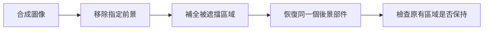
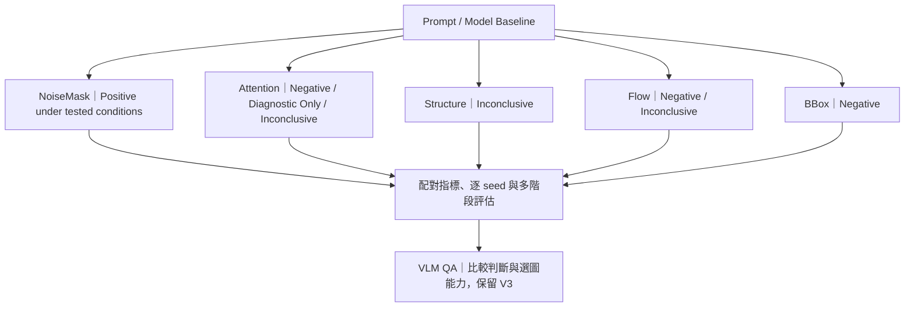
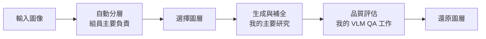

# 非寫實 2D 圖像之前景移除與遮擋區域補全

Foreground Removal and Amodal Completion for Non-Photorealistic 2D Graphics

**移除前景之後，如何補回原本被遮住的特定部件？** 本研究以遊戲 UI 與人物插圖為應用情境，希望恢復被硬幣遮住的寶箱、被物件遮住的角色部件，同時保留原有形狀、位置與畫風，減少美術拆圖與修補工作。

我以 FLUX／Qwen Image Edit 建立 baseline，比較提示詞、區域與生成過程控制，再用配對實驗、失敗案例與 VLM QA 檢查效果；生成側成果整合至團隊的 Layer Lab。

*左起為輸入、目標、Prompt V2、Prompt V2 + NoiseMask。硬幣雖可移除，鎖扣細節仍可能偏離目標。[圖像選取與評估限制](docs/evaluation.md#readme-figure-reading-note) · [更多結果與失敗案例](docs/qualitative_results.md)*

## Layer Lab Demo

https://github.com/user-attachments/assets/5b7b9321-4069-4f06-bf7e-644f1d1b779f

約 1 分 28 秒：**匯入插圖 → 加入遮罩 → 逐層補全 → 檢視與組合圖層 → 回看生成紀錄**。生成等待段已加速。

Demo 主要展示提供遮罩後的逐層補全與圖層操作；完整 Layer Lab 另整合團隊的自動分層模組。[操作說明](docs/system_evolution.md) · [下載 MP4](assets/prototype/Layer_Lab_DEMO.mp4) · [素材來源](docs/public_sources.md#demo-artwork)

## 研究問題

一般物件移除著重補出合理背景；本研究更要求恢復原本被遮住的「特定部件」（Amodal Completion）。例如補成另一個合理的寶箱，仍可能改錯鎖扣或箱體結構。

評估分成三個問題：**前景是否消失、後景是否補對、其他區域是否保持**。

## 研究歷程

先建立基準，再沿不同控制方向做比較；負結果與未定論同樣影響後續選擇。

圖中的 Positive 限於合成資料自動指標；Attention 與 Flow 的多個標籤分別對應不同分支。[6–9 月研究時間軸與完整分支](docs/experiments/00_research_timeline.md)

## 代表性研究結果

### NoiseMask｜降低無關區域變動

Prompt-based editing 能執行移除，但非編輯區域仍可能被改動。因此在相同 Prompt V2 下加入 NoiseMask，保留非編輯區域的 latent，讓修改集中於指定範圍。

Synthetic V2 共 **30 experimental configurations × 27 samples × 5 seeds**，保存 4,050 筆分數；其中相同 Prompt V2 的配對比較如下（9-class macro）：

| 設定 | LPIPS ↓ | PSNR ↑ | SSIM ↑ |
|---|---:|---:|---:|
| Prompt V2 | 0.070 | 25.51 | 0.892 |
| Prompt V2 + NoiseMask 3% | 0.055 | 26.40 | 0.913 |

在目前 Synthetic Benchmark 的自動指標上呈現改善；人工品質仍需獨立判讀。[NoiseMask 實驗與限制](docs/experiments/03_noise_mask.md) · [完整數表](assets/results/paired/table.md)

### BBox Guidance｜負結果

為了讓模型知道要改哪裡，我比較綠框與線寬設定。FLUX.2 的 class-word baseline LPIPS 為 0.085，加入綠框後為 0.459；本設定下未觀察到改善，因此未納入主要流程。視覺框是否被當成內容，仍是可能解釋。[BBox 實驗](docs/experiments/02_region_guidance.md)

### Flow｜區分負結果與尚未完成的驗證

Step-window 試驗未支持替換 baseline；獨立的 FlowEdit transport 分支已完成實作，但缺少完整配對品質評估，維持 Inconclusive。前者的負結果不能外推為所有 Flow 方法無效。[Flow 實驗](docs/experiments/06_flow_editing.md)

### VLM QA｜選到較好候選，與判定可用，是兩個問題

在固定候選的比較中，V7 的 strict stage pass 為 86.8%，V3 為 79.8%；但 V7 未通過預先設定的關鍵錯誤檢查，因此仍保留 V3。選圖收益保留為 Diagnostic Only，替換決策維持 Negative。[VLM QA 實驗](docs/experiments/07_vlm_qa.md)

## 從研究到完整系統

Layer Lab 將研究功能放進可操作的圖層還原流程。以下為完整系統的模組關係：

完整系統由團隊整合；我負責生成側的系統整合。操作展示、合成資料實驗與逐層美術可用性評估各有不同用途。[目前研究理解](docs/research_summary.md)

## 個人貢獻

本 repository 所呈現的圖像生成與補全研究，由我獨立進行研究設計、程式實作、實驗執行與評估分析。我的工作包含 baseline 與控制實驗、mask／evaluation utilities、失敗案例分析、VLM QA，以及生成側的系統整合；完整 Layer Lab 是團隊成果，自動分層模組由組員主要負責。[完整貢獻說明](docs/contributions.md)

## 完整研究紀錄

- [研究時間軸與實驗分支](docs/experiments/00_research_timeline.md)：包含負結果、未定論與歷史工作。
- [質化結果與失敗案例](docs/qualitative_results.md)：配對圖與所有 seed 的變化。
- [量化結果與多階段評估](docs/experiments/08_evaluation.md)：Synthetic V2／V3。
- [企業合作資料整體結果](docs/industry_aggregate_results.md)：QA、推論步數與 Flow 比較。
- [評估方法與限制](docs/evaluation.md)：量測範圍、輸入條件與原始 CSV／JSON。
- [Selected Implementation](docs/selected_implementation.md)：精選工具、測試與執行方式。

## Repository Scope

這是研究展示 repository，收錄研究敘事、可公開結果與精選實作。企業合作資料僅提供整體量化結果；資料來源與重用條件見 [NOTICE](NOTICE.md) 與 [來源說明](docs/public_sources.md)。
