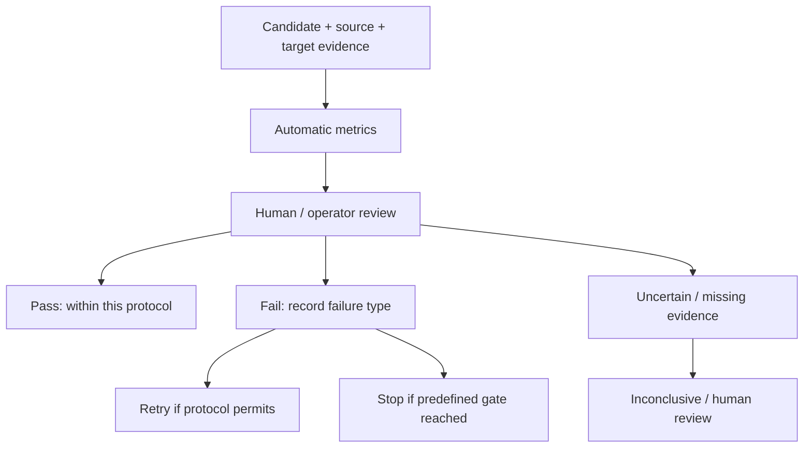

# 評估方法與 Benchmark 效度

研究目標是恢復特定後景部件的 identity、appearance、geometry、position 與 style consistency；不是任意看似合理的背景。

## 三個獨立品質問題

1. Foreground Removal：指定前景是否移除，有無殘渣或重新生成。
2. Amodal Completion：是否補回指定部件，而非錯誤部件、平坦填色或幻覺。
3. Region Preservation：非編輯區域、幾何與位置是否保持。不能只看被遮擋區。

Synthetic／AI-generated benchmark 可支持 smoke、controlled experiments、mechanism diagnosis、reproducibility、parameter comparison 與 baseline calibration，不能單獨支持對真實非寫實美術普遍有效。

已知合成層的像素可作該合成操作的精確參考，但不是 artist-authored exact GT；model-segmented／inpainted 資料只是 pseudo-label。正式真實美術主張仍需要權利清楚、artist-authored 的 component-level benchmark 與 operator QA。

## Synthetic V2 的量測範圍

固定 9 classes、27 samples、5 inference seeds，30 experimental configurations 的完整逐 seed scores 共 4,050 筆。這 30 個設定包括模型、prompt、mask 與 parameter variants，不是 30 個獨立研究方法。歷史資料中的 `method`／`methods` 欄位保留原 schema，應讀作 configuration identifiers。coverage 與 class 綁定，所以不能作覆蓋率的因果推論。模型／方法／guidance／oracle 分欄保存，跨 input privilege 不做 input-fair 排名。

公開 [protocol.json](../assets/results/synthetic_v2/protocol.json) 記錄 ROI、fallback、metrics、aggregation 與相依版本；[scores.csv](../assets/results/synthetic_v2/scores.csv) 保存逐 sample／seed 分數。[summary.json](../assets/results/synthetic_v2/summary.json) 保存分層與 paired summaries。

Object-centric normalization 可能淡化位置 drift；必須搭配 full-canvas inspection。ROI failure 也須保留，不能只平均成功定位的結果。歷史 exact-mask 與目前 object-centric 分數不直接互比。LPIPS 不是人類偏好，PSNR／SSIM 也不等同美術可用性。

## Research Evaluation Flow

Parameter、prompt、strength、step-window 或 seed search 是校準與消融，不能單獨宣稱 novel algorithmic contribution。新方法須說明改變的計算、適用範圍、baseline 退化邊界與 component ablation。

## Private Industry Dataset

企業合作資料僅納入經篩選的 [aggregate quantitative results](industry_aggregate_results.md)。原圖、result image、mask、crop、個別 case、內部 metadata 與合作企業名稱均不公開。可能由小群組、互補統計或外部資訊反推出個例的數字，不納入公開統計。

## README Figure Reading Note

README 首圖比較 Qwen Image Edit 2511 Prompt V2 與同提示詞 NoiseMask 3%，選取同一 sample、同一 seed 的三組高差距改善案例。先依既有 135 組配對的 LPIPS 差值找出候選，再檢視 baseline 是否出現可見錯誤；目前三組為差值最大的三組，皆為 seed 0。這是指定目的的案例選取，與 Gallery 原有 median-LPIPS 配對圖分開呈現；不代表平均表現或全 seed 成功率，也不是新增人工 QA 通過判定。

素材全為研究者自行生成的 Synthetic V2，使用 oracle class words／mask，輸出為黑底 RGB research surrogate。它們不是 RGBA 完整層驗收，也不證明 artist-authored artwork 的普遍補全能力。[選取案例與完整 all-seed 圖](qualitative_results.md#selected-improvements)保留其他 seed 的失敗與變化。

首圖依 Input → Remove foreground → Baseline → NoiseMask → Target 排列；Remove foreground 欄顯示實際 NoiseMask 3% 的編輯遮罩，並非另一個生成階段。Baseline 與 NoiseMask 是兩個比較設定，Target 是合成參考。圖像區塊直接取自完整 all-seed 圖，沒有重繪或修改生成內容；[選取紀錄](../assets/results/paired/hero_selection.json)保存 sample、seed、原始分數與來源圖像區塊對應。原有寶箱首圖與 median-seed 配對圖仍保留。

原分析的 object-centric metrics 使用既有 ROI normalization，可能淡化位置 drift；須配合 full-canvas inspection。README 數值表則為 9-class macro。兩者不能當作逐張 operator 判定，也不可與 V3 reveal-region 或企業 direct-reveal 指標混排。Automatic metrics、人工 review 與實際 RGBA 可用性是不同證據。
