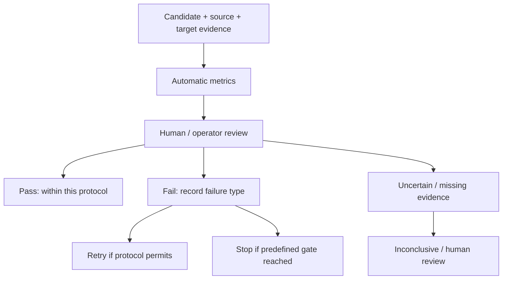

# 評估契約與 benchmark 效度

研究目標是恢復特定後景部件的 identity、appearance、geometry、position 與 style consistency；不是任意看似合理的背景。

## 三個獨立品質問題

1. Foreground Removal：指定前景是否移除，有無殘渣或重新生成。
2. Amodal Completion：是否補回指定部件，而非錯誤部件、平坦填色或幻覺。
3. Region Preservation：非編輯區域、幾何與位置是否保持。不能只看被遮擋區。

Synthetic／AI-generated benchmark 可支持 smoke、controlled experiments、mechanism diagnosis、reproducibility、parameter comparison 與 baseline calibration，不能單獨支持對真實非寫實美術普遍有效。

已知合成層的像素可作該合成操作的精確參考，但不是 artist-authored exact GT；model-segmented／inpainted 資料只是 pseudo-label。正式真實美術主張仍需要權利清楚、artist-authored 的 component-level benchmark 與 operator QA。

## Synthetic V2 的量測範圍

固定 9 classes、27 samples、5 inference seeds，30 methods 的完整逐 seed scores 共 4,050 筆。coverage 與 class 綁定，所以不能作覆蓋率的因果推論。模型／方法／guidance／oracle 分欄保存，跨 input privilege 不做 input-fair 排名。

公開 [protocol.json](../assets/results/synthetic_v2/protocol.json) 記錄 ROI、fallback、metrics、aggregation 與相依版本；[scores.csv](../assets/results/synthetic_v2/scores.csv) 保存逐 sample／seed 分數。[summary.json](../assets/results/synthetic_v2/summary.json) 保存分層與 paired summaries。

Object-centric normalization 可能淡化位置 drift；必須搭配 full-canvas inspection。ROI failure 也須保留，不能只平均成功定位的結果。歷史 exact-mask 與目前 object-centric 分數不直接互比。LPIPS 不是人類偏好，PSNR／SSIM 也不等同美術可用性。

## Research Evaluation Flow

Parameter、prompt、strength、step-window 或 seed search 是校準與消融，不能單獨宣稱 novel algorithmic contribution。新方法須說明改變的計算、適用範圍、baseline 退化邊界與 component ablation。

## Private Industry Dataset

部分研究使用企業合作提供之非公開 2D 圖像資料。此候選不公開原始圖像、個別案例或內部 metadata。整體量化數值尚未取得明確公開確認，因此本版也不刊登企業 aggregate；這不代表未做過相關實驗。
