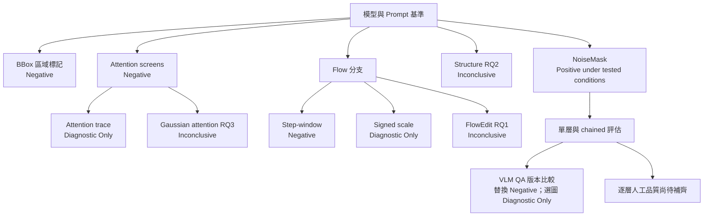

# 研究時間軸與分支

從 6 月到 9 月，研究逐步從「能否移除物件」走向「能否還原特定部件，並判斷每層是否可用」。控制方法分支與評估工作並行；有些設定保留，有些得到負結果，有些仍缺品質驗證。

## 6–9 月：問題如何演進

| 時期 | 研究問題 | 關鍵發現 | 下一步 |
|---|---|---|---|
| 6 月至 7 月初 | 文字與位置資訊是否足以指定補全目標？ | 破損層單獨輸入仍難保持特定部件；BBox 未帶來預期改善 | 建立模型／提示詞 baseline，繼續比較輸入形式 |
| 7 月 | 如何限制無關區域變動？ | Synth V2／V3 提供固定比較資料；NoiseMask 在特定合成設定有自動指標收益 | 做相同 Prompt V2 的配對比較，保留完整 seed 差異 |
| 7 月至 8 月 | Attention、KV-Edit 與 reference 是否能增加控制力？ | 多個 screens 得到限定範圍負結果，另有部分執行與未定論工作 | 停止未達條件的設定，區分機制觀察與品質收益 |
| 8 月 | 多層生成後，如何檢查和挑選結果？ | Naming、Completion QA 與圖層操作形成評估需求 | 分開比較候選判斷、選圖與重試，整合補全操作介面 |
| 8 月下旬 | Flow 與幾何 reference 能否補足結構資訊？ | Step-window 未支持替換 baseline；RQ2 只完成幾何可行性，RQ1／RQ3 尚缺品質比較 | 分開保存負結果與待驗證分支；推進 standalone 系統整合 |
| 8 月底至 9 月 | 新 QA 與更多 steps 是否值得採用？ | Frozen QA 保留 V3；steps 尚待人工評估；attention trace 僅供診斷 | 補齊逐層人工評估，持續檢查特定部件與 RGBA 可用性 |

## 研究分支圖

此圖整理問題的分支關係，不代表所有實驗按單一路徑依序完成。NoiseMask 的 Positive 僅限已測合成資料自動指標；其餘標籤也各有對應測試範圍。

## 依問題深入閱讀

| 研究問題 | 主要發現與後續選擇 | 詳細頁 |
|---|---|---|
| 模型與提示詞能做到什麼？ | 建立歷史 baseline；人工品質仍為 Inconclusive | [01 Baselines](01_baselines.md) |
| 畫框能否幫助指定區域？ | Negative；未納入主要流程 | [02 BBox](02_region_guidance.md) |
| 限制修改範圍是否有用？ | 合成資料自動指標改善；保留 Qwen Prompt V2 + NoiseMask 3%，人工比較待完成 | [03 NoiseMask](03_noise_mask.md) |
| Attention 控制與觀察各能回答什麼？ | Screens 保留負結果；trace 僅供診斷；RQ3 未定論 | [04 Attention](04_attention_control.md) |
| 可見幾何是否能引導隱藏結構？ | Guide 可建構，生成品質未測；Inconclusive／Experimental | [05 Structure](05_structure_guidance.md) |
| 時間窗與 FlowEdit 是否改善補全？ | Step-window Negative；RQ1 Inconclusive／Experimental | [06 Flow](06_flow_editing.md) |
| QA 是否能可靠挑選可用結果？ | 新版未滿足替換條件，保留 V3；selector 收益只作診斷 | [07 VLM QA](07_vlm_qa.md) |
| 多階段與推論步數如何評估？ | 自動分數已保存，逐階段人工判讀仍有缺口；Inconclusive | [08 Evaluation](08_evaluation.md) |

[其他歷史分支、停止矩陣與詳細狀態](09_historical_branches.md)保留未完成與未採用工作。[目前研究理解](../research_summary.md)整理採用流程與開放問題；[Layer Lab](../system_evolution.md)展示操作整合。
