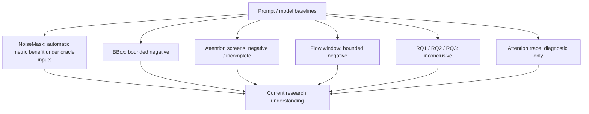

# 研究時間軸與分支

截至 2026-09-10 的本機文件、程式與 artifact 核對；未重新執行生成或人工 QA。

| 時期 | 問題／分支 | 證據與轉折 |
|---|---|---|
| 6 月至 7 月初 | 定義特定部件 amodal completion；prompt／BBox baseline | 破損層單獨輸入並不足以保證 identity；輸入契約保持開放 |
| 7 月 | Synth V2／V3、NoiseMask、KV-Edit、Attentive Eraser | 建立 automatic analysis；保留失敗、oracle 限制與 partial run |
| 7 月至 8 月 | Attention screens、reference、VLM capability、chained QA | 多分支停止或無定論；未把複雜度視為進步 |
| 8 月 | Naming／Completion QA、Legacy Research Prototype | 操作與評估需求形成可用介面；產品選擇與研究 gate 分離 |
| 8 月下旬 | Flow pilot、RQ1／RQ2／RQ3、standalone migration | Flow 有 bounded negative；geometry viability 不證明補全品質 |
| 8 月底至 9 月 | Frozen QA、steps 與 attention trace | Retain V3；新 trace 僅 diagnostic，pending QA 不升格 |

| Experiment | Execution | Evidence | Conclusion | Adoption |
|---|---|---|---|---|
| [Prompt 與模型 baseline](01_baselines.md) | Generation Completed | Automatic Metrics; partial Human QA | Inconclusive | Historical |
| [BBox 與區域資訊](02_region_guidance.md) | Generation Completed | Automatic Metrics | Negative under tested metric conditions | Not Adopted |
| [NoiseMask 與輸入消融](03_noise_mask.md) | Generation Completed; parent matrix Partially Run | Automatic Metrics; matched Human QA pending | Positive under tested automatic metrics | Current for Qwen class-word V2 contract |
| [Attention 干預與診斷](04_attention_control.md) | Generation Completed for screens; RQ3 Implemented | Partial Evidence; Automatic Metrics; diagnostic traces | Negative for bounded screens; Diagnostic Only for traces; Inconclusive for RQ3 | Not Adopted / Experimental |
| [Matched structure reference](05_structure_guidance.md) | Implemented; formal Not Run in audited evidence | CPU geometry viability only | Inconclusive | Experimental |
| [Flow guidance 與 FlowEdit transport](06_flow_editing.md) | Generation Completed for step-window; RQ1 Implemented | Operator QA for bounded pilot; RQ1 Missing Required Evidence | Negative for tested step-window; Inconclusive for RQ1 | Not Adopted / Experimental |
| [VLM QA、selection 與 retry](07_vlm_qa.md) | Generation Completed for frozen replay | Operator labels and matched diagnostic comparison | Negative for replacement decision; Diagnostic Only for selector gains | Retain V3; V7 Not Adopted |
| [Benchmark、chained evaluation 與 steps](08_evaluation.md) | Generation Completed for chained and steps | Automatic Metrics; incomplete stage-level QA | Inconclusive | Current evaluation practice; quality pending |

[其他歷史分支與停止矩陣](09_historical_branches.md)
