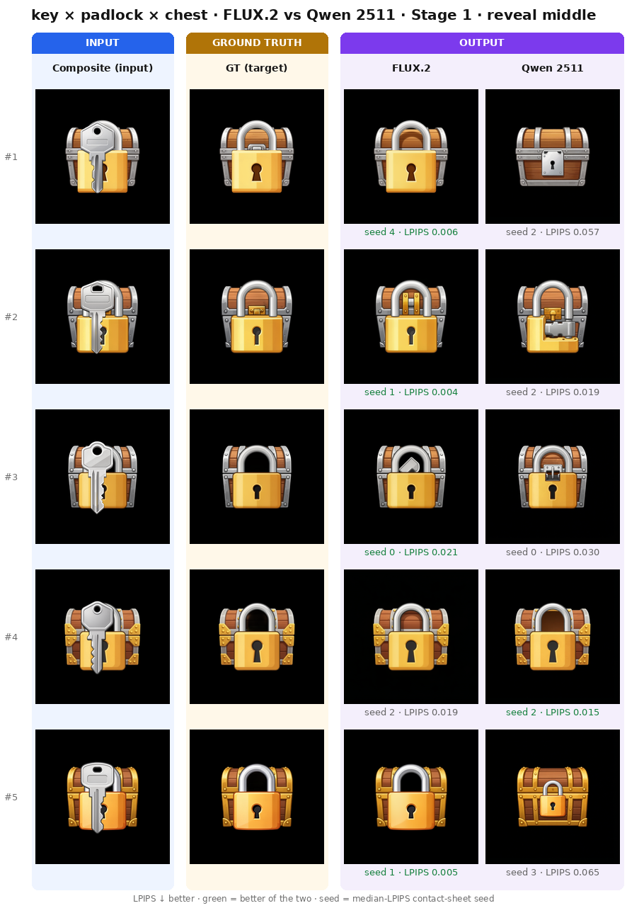
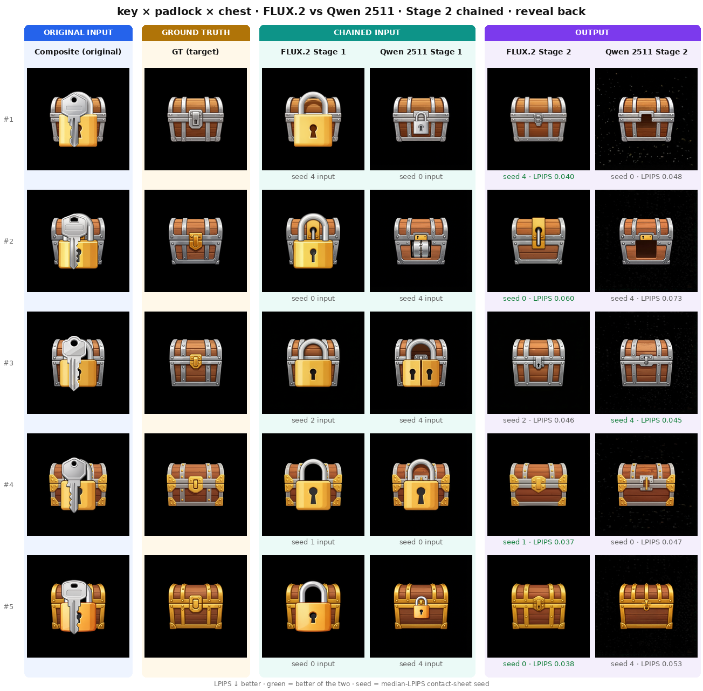

# 從單層到多層：Benchmark 與補全評估

## 研究動機

單張補全看似合理，放進逐層流程後仍可能累積錯誤；重新合成時，上層又可能遮住下層缺陷。因此評估要同時追蹤單層內容、逐階段輸入，以及完整重建的差異。

## 實驗設計

| 比較 | 固定條件與量測範圍 |
|---|---|
| Synthetic V2 | 9 classes、27 samples、seeds 0–4；object-centric analysis |
| Synthetic V3 | 50 samples、5 seeds、2 stages；量測 reveal region |
| Inference steps | 固定 Qwen 2511 NoiseMask 輸入，20／30／40 steps；量測 direct-reveal 區域與推論時間 |

V2 共 30 experimental configurations、4,050 筆分數，包含模型、prompt、mask 與參數變體。已知類別與遮罩屬於 oracle input。歷史 exact-mask、V2 object-centric、V3 reveal-region 與企業 direct-reveal 各自保留評分定義，不跨表直接排名。

V3 每模型 500 predictions：Stage 1 移除前景 F，目標為中景 M + 背景 B；Stage 2 使用**實際 Stage 1 prediction**，再移除 M，目標為 B。FLUX.2-dev 使用 30 steps，Qwen Image Edit 2511 使用 40 steps，兩者 guidance 都為 4.0，並非 equal-step comparison。

## 結果

V2 的 [Prompt V2／NoiseMask 配對結果](03_noise_mask.md)已有完整自動分數。V3 兩模型也完成 chained predictions，以下摘錄既有 10-class macro：

| 階段 | 設定 | LPIPS ↓ | PSNR ↑ | SSIM ↑ |
|---|---|---:|---:|---:|
| Stage 1 | FLUX.2 | 0.009 | 22.55 | 0.867 |
| Stage 1 | Qwen 2511 | 0.015 | 17.73 | 0.677 |
| Stage 2 chained | FLUX.2 | 0.021 | 21.09 | 0.865 |
| Stage 2 chained | Qwen 2511 | 0.040 | 17.22 | 0.574 |

[完整 V3 表格](../../assets/results/synthetic_v3/table.md)保留每類結果、CI 與 sample wins。

企業合作資料的 steps 比較已保存自動指標與時間：20／30／40 steps 的平均推論時間分別為 36.69／54.66／66.48 秒，品質指標沒有形成一致的排序，仍待人工判讀。[完整 steps 比較](../industry_aggregate_results.md)

## 判讀

多階段補全與 steps 的整體品質結論維持 **Inconclusive**。目前已確認 V3 Stage 2 的資料銜接正確；逐層補全品質仍待人工評估。

這些結果仍以 RGB surrogate 評估。上層可能遮住下層缺陷，完整重建圖不能取代獨立部件檢視；V2 的 ROI normalization 也可能淡化位置偏移。合成資料收益不能直接推論真實美術效果。

Steps 的時間僅為當次環境的模型推論，未含分層、傳輸與 QA，並非端到端 latency。Direct-reveal 是局部可見參考，並非被遮擋區域的完整美術 GT。

## 對後續研究的影響

目前保留單層、逐 seed 與 chained 分開評估的做法（**Current evaluation practice**），品質仍待人工確認。後續需要補齊逐階段判讀，分別辨識前景殘留、補全不完整、錯誤部件與非編輯區域破壞。

## 詳細證據

- V2：[protocol](../../assets/results/synthetic_v2/protocol.json)、[summary](../../assets/results/synthetic_v2/summary.json)、[逐 seed scores](../../assets/results/synthetic_v2/scores.csv)、[配對表](../../assets/results/paired/table.md)。
- V3：[完整比較表](../../assets/results/synthetic_v3/table.md)、[FLUX summary](../../assets/results/synthetic_v3/flux2_summary.json)、[Qwen summary](../../assets/results/synthetic_v3/qwen2511_summary.json)。
- [評估方法與限制](../evaluation.md)、[質化結果與失敗案例](../qualitative_results.md)、[企業合作資料整體結果](../industry_aggregate_results.md)。

[返回研究時間軸](00_research_timeline.md)
