# 質化結果與失敗案例

本頁用原有圖像回答三個問題：前景有沒有消失、指定後景有沒有補對、其他區域有沒有保持。配對圖涵蓋九類合成案例，失敗區與完整 seed 變化一併保留。

以下比較 Qwen Prompt V2 與同提示詞加入 NoiseMask 3% 的結果。輸入使用已知類別與遮罩，輸出為 RGB surrogate，詳見 [評估方法與限制](evaluation.md#readme-figure-reading-note)。

## 從編輯失敗到改善：精選配對案例

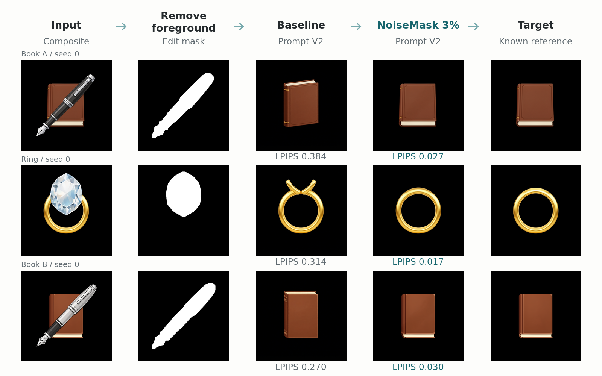

在相同輸入與 seed 下，baseline 移除了前景，卻將書本改成不同視角，或為戒指增加目標沒有的凸起；NoiseMask 結果較接近原有部件的結構。這展示的是部件保持與補全的改善，不只是前景消失。

| 圖中案例 | Synthetic sample | Seed | Baseline LPIPS ↓ | NoiseMask LPIPS ↓ | 可見差異 |
|---|---|---:|---:|---:|---|
| Book A | pen_x_book_cov30_1 | 0 | 0.384 | 0.027 | Baseline 改變書本視角與書頁方向；NoiseMask 保留較接近目標的封面與書脊 |
| Ring | gem_x_ring_cov30_1 | 0 | 0.314 | 0.017 | Baseline 生成多餘的上方凸起；NoiseMask 恢復接近目標的圓環 |
| Book B | pen_x_book_cov30_0 | 0 | 0.270 | 0.030 | Baseline 改變書本立體結構；NoiseMask 保留較接近目標的輪廓與書頁方向 |

這些案例呈現 NoiseMask 對部件結構的改善。逐筆分數見 [scores.csv](../assets/results/synthetic_v2/scores.csv)，整體效果見 [完整配對數表](../assets/results/paired/table.md)。

查看這兩類素材的全部 seed，包括未改善與失敗結果

### 書本｜Baseline，全部 seeds

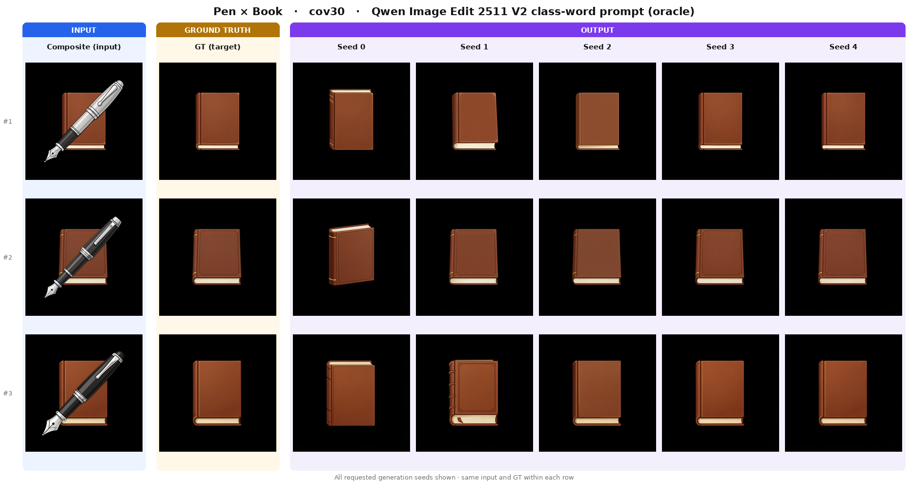

### 書本｜NoiseMask，全部 seeds

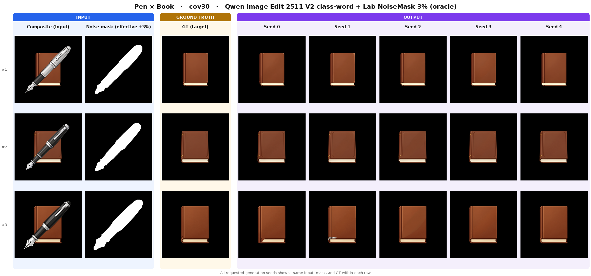

### 戒指｜Baseline，全部 seeds

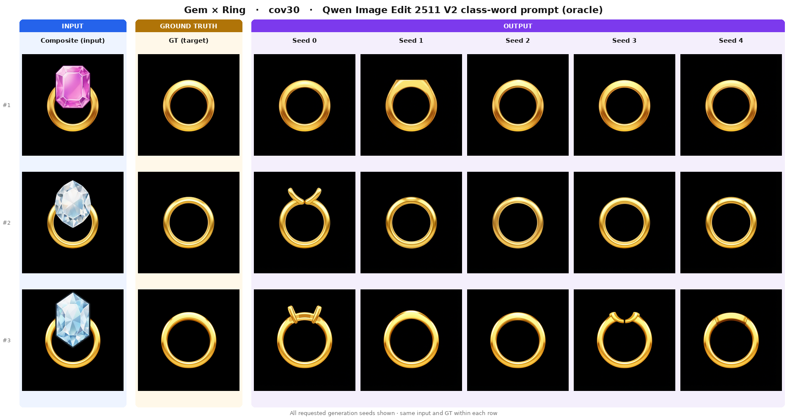

### 戒指｜NoiseMask，全部 seeds

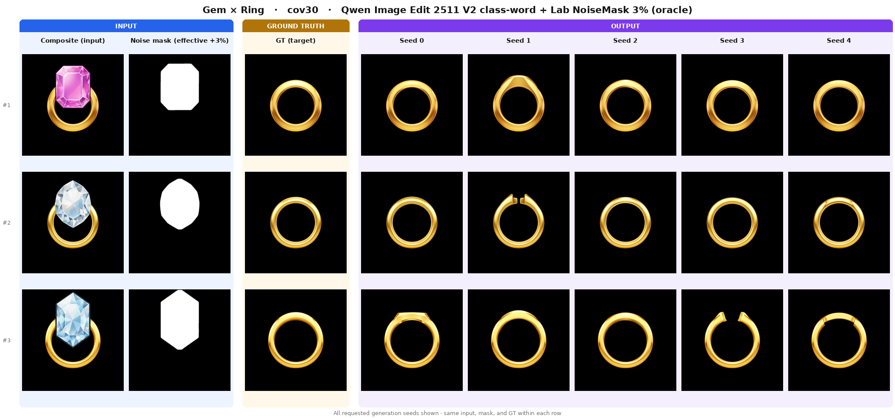

不同 seeds 間仍可觀察到缺口與形狀變化，顯示方法收益並非在所有生成結果中一致。

## 代表性補全結果

### 寶箱補全｜高遮擋案例

兩種設定都移除了硬幣，但鎖扣的形狀、顏色與位置仍可能偏離目標。第 2 列加入 NoiseMask 後的 LPIPS 較低，第 1、3 列則未較低；不同樣本的改善程度並不一致，整體效果請參考完整配對統計。

### 旗幟補全｜移除徽章後的布面

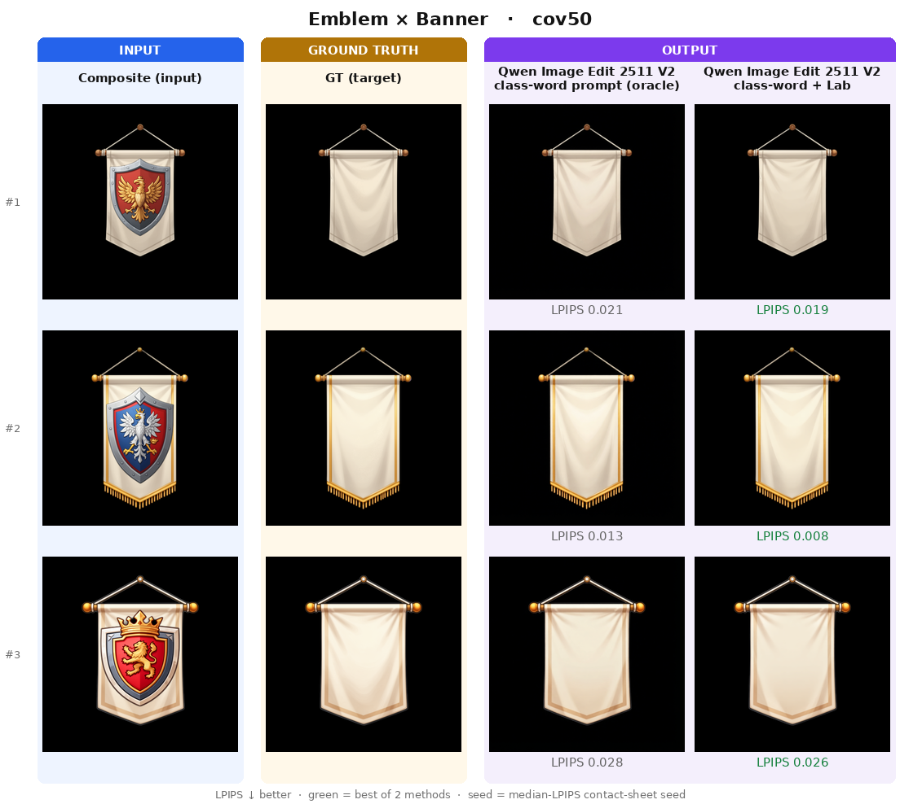

兩種設定都補出布面，主要差異在摺痕與明暗，整體視覺差異有限。自動分數的小幅差距仍需搭配布料細節檢視。

### 餐盤補全｜輪廓與高光

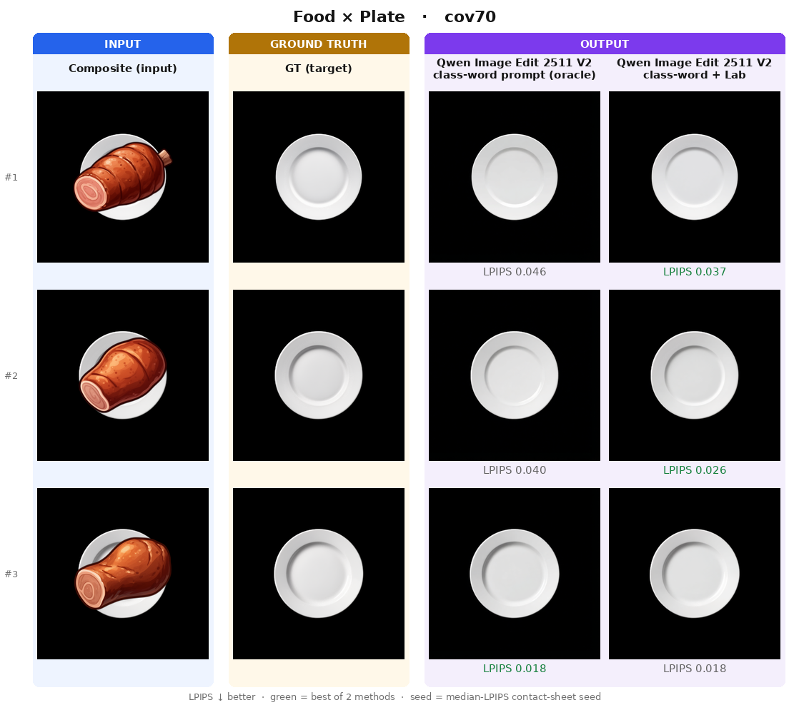

食物被移除後，盤面輪廓大致形成，但盤緣與內圈的高光、厚度仍有差異。第 3 列顯示兩設定的圖上 LPIPS 同為 0.018。

### 戒指補全｜圓環幾何

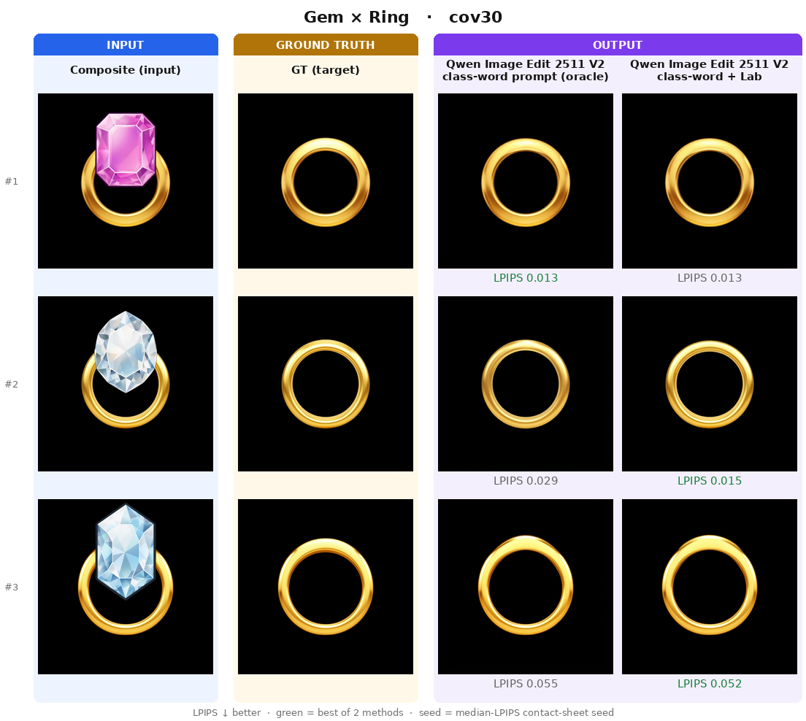

兩種設定都生成無寶石的圓環；第 3 列的輪廓仍偏離目標的規則圓形。低分數差異與幾何是否正確需分開看。

### 鐵砧補全｜細小邊緣與底座

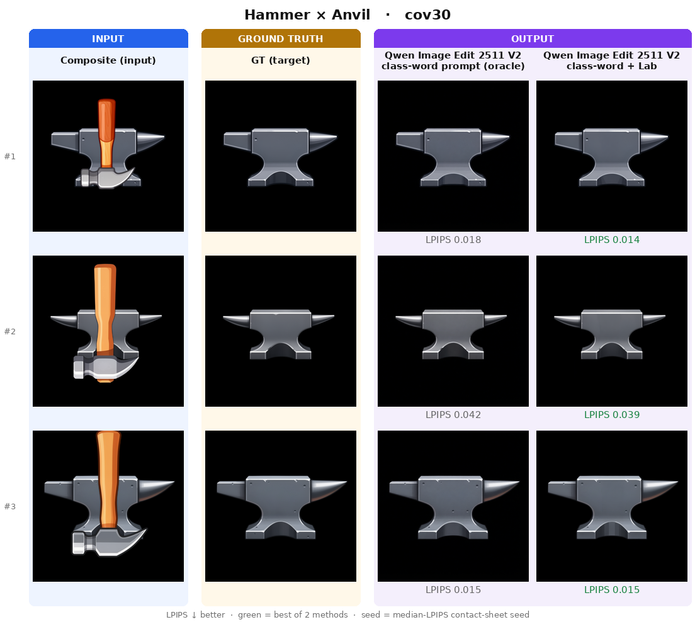

錘子被移除後，兩種設定的鐵砧形狀接近；差異集中於表面明暗與底座細節。第 3 列兩設定的圖上分數相同，該列未呈現明確改善。

### 鎖頭補全｜遺失的鑰匙孔

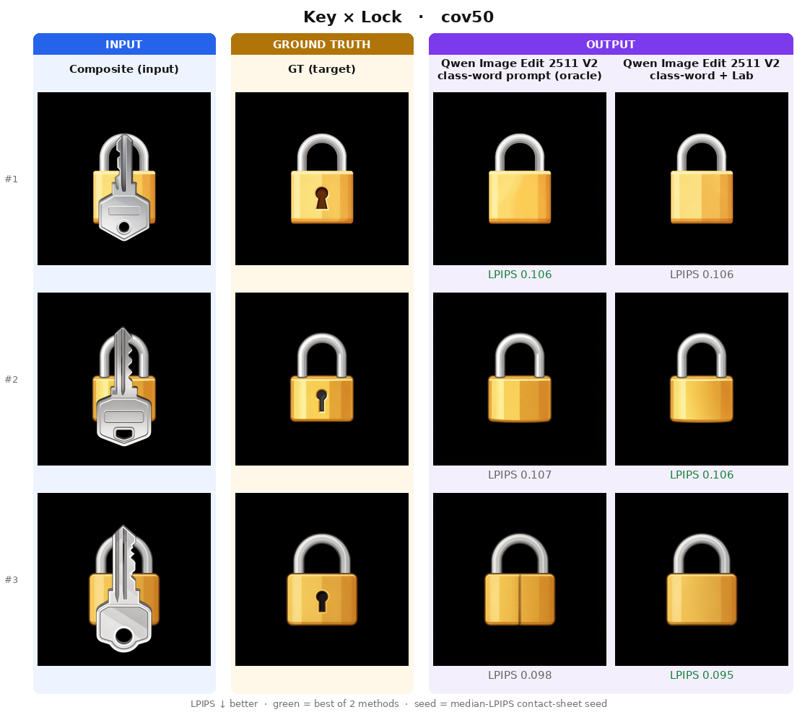

兩種設定都移除了鑰匙，卻沒有補回目標的鑰匙孔。這是『前景消失，但指定部件細節未還原』的明確例子。

### 書本補全｜保留封面與書脊

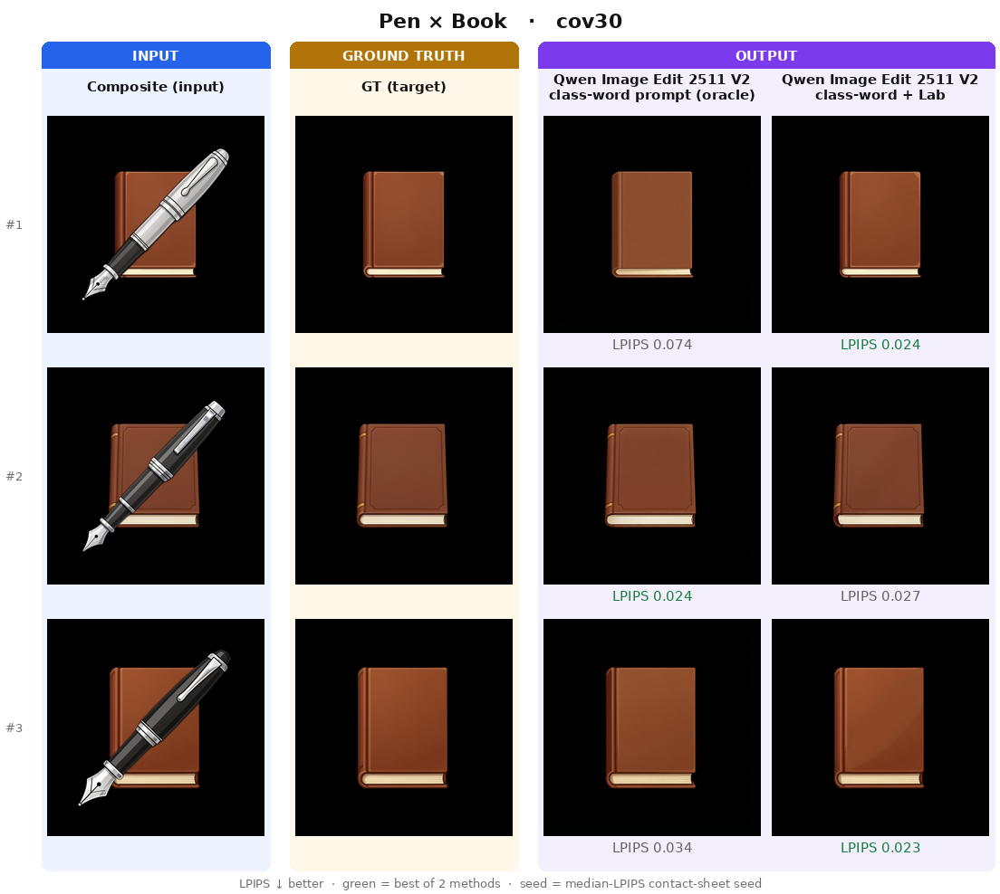

第 1 列 NoiseMask 結果的書脊與封面輪廓較接近目標，但第 2 列 baseline 的圖上 LPIPS 較低。不同樣本的收益並不一致。

### 木箱補全｜移除藥水瓶

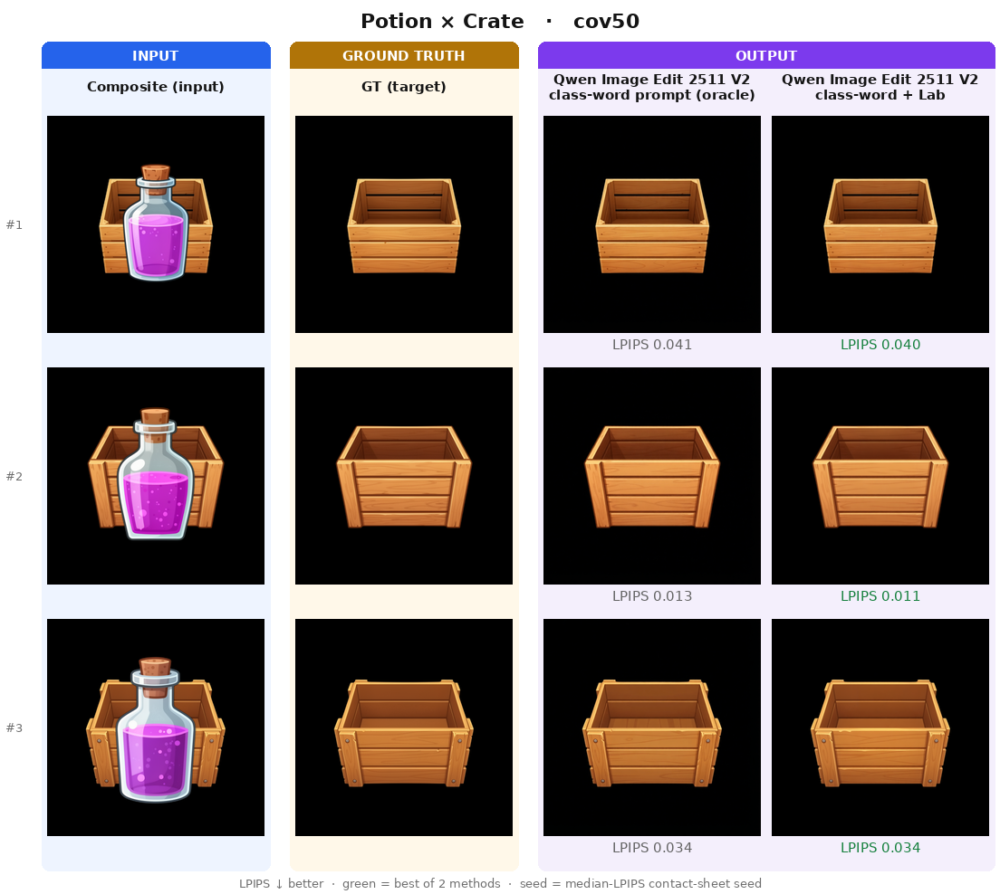

兩種設定都移除了瓶子並延續木板結構，主要差異在木紋與陰影。整體視覺差異有限，仍需檢查原有板條是否被改寫。

### 盾牌補全｜中央結構保持

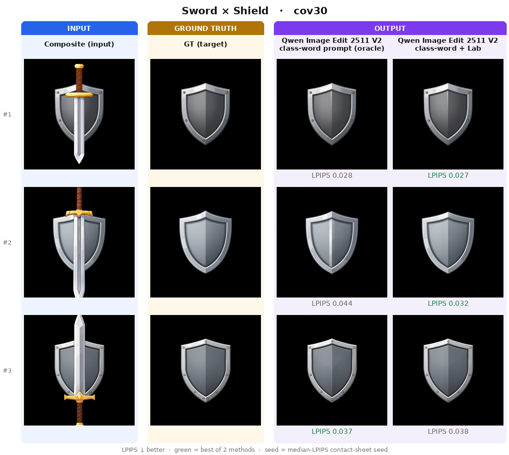

移除劍之後，兩種設定保留盾牌主體；中央稜線與明暗可能改變。第 3 列反而由 baseline 取得略低 LPIPS，顯示收益並非所有案例一致。

[完整配對數表](../assets/results/paired/table.md)保留每類聚合；圖上個別 seed 分數與全 seed 聚合回答不同問題。

## 典型失敗案例與完整 seed 變化

以下三張圖皆保留 seeds 0–4。以下依畫面可直接觀察的失敗型態整理，不推定未經驗證的內部成因。

### 前景殘留｜FLUX.2 寶石與戒指

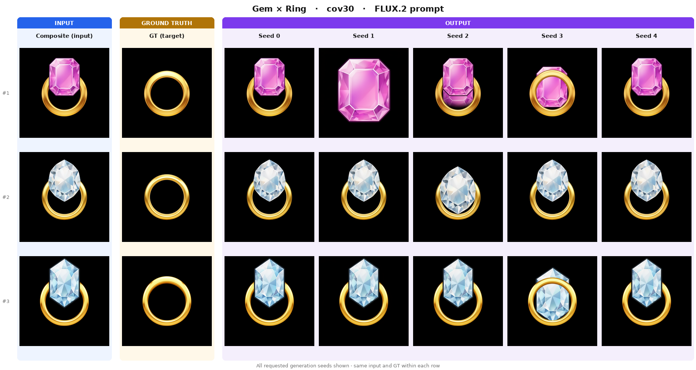

目標是只有圓環的戒指，但多個輸出仍保留大面積寶石；第 1 列 seed 1 甚至只剩放大的寶石。這是前景未移除，不能因結果像一枚合理的寶石戒指就視為任務完成。

### 補全不完整｜Attentive Eraser 寶箱案例

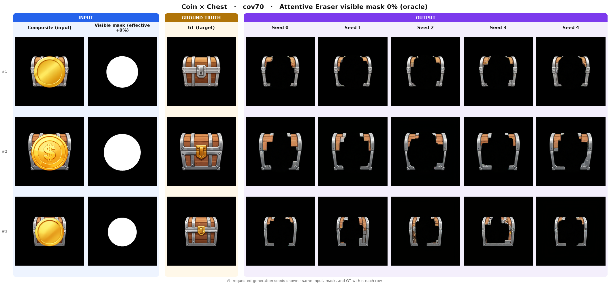

硬幣所在區域變成黑色缺口，周圍仍可見寶箱框架，但中央箱體沒有還原。這和上例的前景殘留是不同問題：移除可以發生，補全仍可能不足。[Attention 研究判讀](experiments/04_attention_control.md)

### 部件細節漂移與多餘符號｜Qwen + NoiseMask 寶箱案例

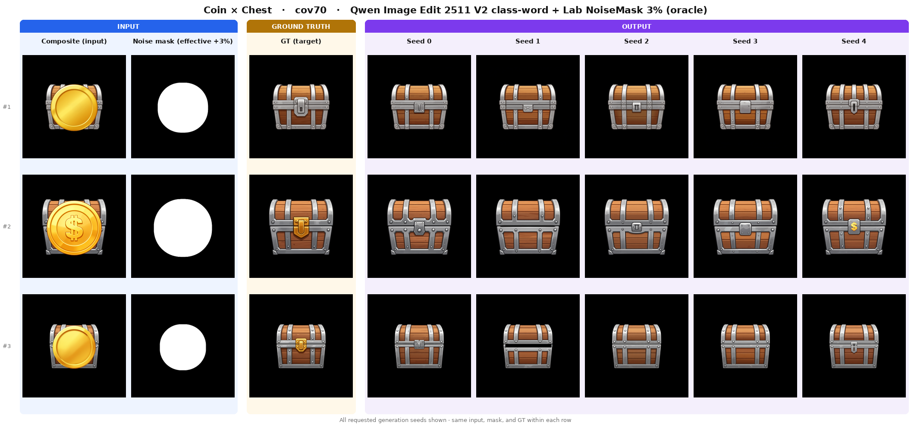

箱體大致形成，但不同 seeds 改寫了鎖扣樣式與金屬結構。第 2 列 seed 4 在鎖扣位置出現目標沒有的美元符號，可標為多餘內容；符號是否由前景硬幣資訊帶入，仍需另外驗證。

### 如何看非編輯區域

補全之外，也要對照仍可見的外框、表面與位置。現有配對圖經 object-centric normalization，可能淡化位移。Region Damage 需回到 full-canvas 與實際編輯範圍判定，見 [評估方法](evaluation.md)。

## 多階段補全

[兩階段 Synthetic V3 結果](experiments/08_evaluation.md)展示使用上一階段實際輸出繼續移除的流程，並保留 Stage 1／Stage 2 圖與完整比較表。上層遮住下層瑕疵時，重建圖可能顯得完整，因此仍要檢視各層。

[返回研究時間軸](experiments/00_research_timeline.md) · [返回 README](../README.md)
