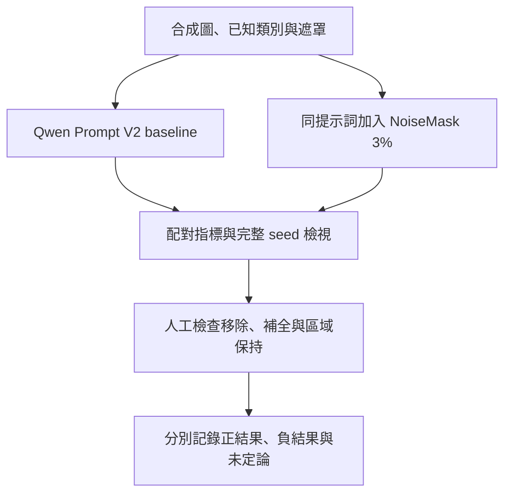

# 目前研究理解

## 目前得到的主要發現

**限制無關修改，是補全品質的重要一環。** 在已知類別與遮罩的合成資料條件下，Qwen Prompt V2 加入 Lab NoiseMask 3% 後，自動指標改善；但寶箱鎖扣等細節仍可能被改寫，人工品質須另外判讀。[NoiseMask 實驗](experiments/03_noise_mask.md)

**更複雜的控制沒有自然帶來更好的結果。** BBox 與已測 Flow step-window 保留負結果；Attention screens 有限定範圍負結果，trace 僅供機制觀察；Structure、FlowEdit RQ1 與 Attention RQ3 仍缺完整品質比較。[研究分支](experiments/00_research_timeline.md)

**QA 的選圖能力與判定可用的能力，需要分開衡量。** Frozen QA 比較中，部分新版選圖指標較好，但未滿足替換條件，整合流程仍保留 Completion QA V3。[VLM QA](experiments/07_vlm_qa.md)

## 目前採用的研究流程

目前採用的研究設定是 Qwen class-word Prompt V2 + Lab NoiseMask 3%，適用於 synthetic oracle 比較。Layer Lab 的操作流程使用通用移除提示詞與 Completion QA V3，研究配方和系統使用情境分開記錄。

Layer Lab 是已整合的預發布原型。它優先採用通過 QA 的候選；沒有通過者時，可保留 fail／uncertain 提示供使用者檢視、選擇目前較佳結果或重新生成。研究仍依獨立品質判定記錄這些結果。[系統操作](system_evolution.md) · [評估方法](evaluation.md)

## 尚未解決的問題

- **特定部件的恢復**：外觀合理仍可能改錯鎖扣、幾何或紋理，需要對照真正目標逐項檢視。
- **RGBA 圖層可用性**：長期目標是可獨立使用的完整部件；歷史合成實驗多以黑底 RGB surrogate 評估，系統輸出的 alpha、位置與部件內容仍需逐層驗證。
- **人工與多階段評估**：Prompt V2 配對、V3 Stage 2 與 steps 比較仍有人工判讀缺口；重建圖也可能遮住下層問題。
- **結構與生成機制**：Structure guide 可建構，但品質收益未測；FlowEdit RQ1 與 Attention RQ3 需完成自己的配對比較。
- **真實美術泛化**：合成資料可支援控制實驗，普遍美術效果仍需要權利明確、artist-authored 的部件級 benchmark 與人工評估。模型推測的遮罩或補全圖僅能作輔助參考。

[完整時間軸](experiments/00_research_timeline.md) · [質化結果與失敗案例](qualitative_results.md) · [企業合作資料整體結果](industry_aggregate_results.md)
