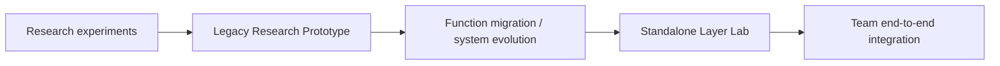
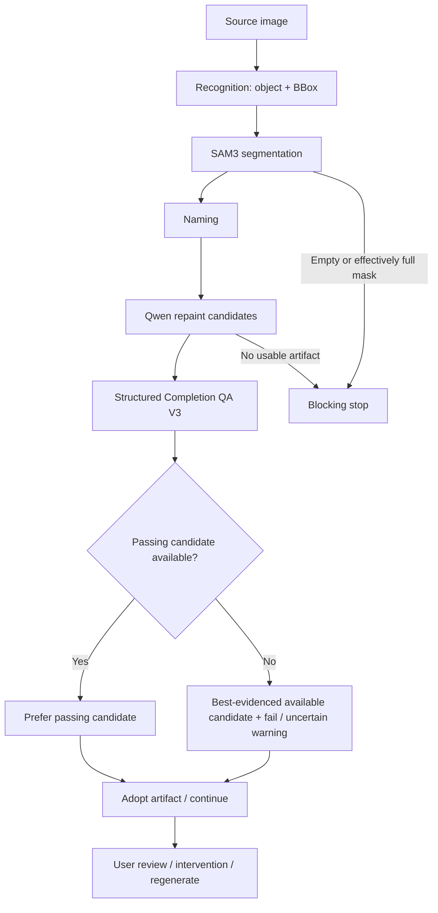
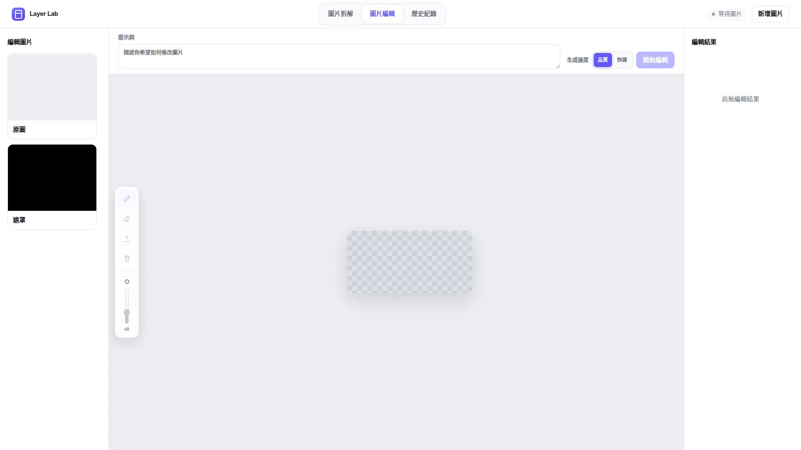

# 從研究到整合系統

## Legacy Research Prototype

早期 Layer Lab 承載生成、補全、QA 與結果檢視；目前只作歷史、rollback 與研究參考，不是現行主要版本。其存在證明功能曾被接入操作流程，不等於研究品質問題已解決。

## Standalone Layer Lab

目前獨立專案具有自己的 API、UI、workflow、dependencies 與測試。現行 README 明確標為 **Pre-release Integrated Prototype**，尚非 production-ready 或 final product。此頁依本機 checkout 的 README、實作、近期變更與 migration 紀錄核對，不代表此次重新驗收了部署。

研究者的生成／補全／研究功能，與組員的自動分層模組、團隊整合，共同形成 end-to-end 系統；不能只用有沒有自動分層來描述兩版差異。

## Product / Layer Lab Workflow

產品可繼續使用不等於研究 quality gate passed。Transport／parse failures 和品質 warnings 依實際可用 artifact 分開處理；中斷可從已採用圖層恢復。

## Demo

[Layer Lab Demo（約 1 分 28 秒）](../assets/prototype/Layer_Lab_DEMO.mp4)展示提供既有 masks 後的逐層生成／補全、部件檢視與候選歷史。影片無音軌，生成等待段已加速。

畫面操作與路由較接近 Legacy 實作，但缺乏錄製時的 runtime／commit 證據，不能排除較早的 standalone 或其他部署設定。因此使用中性標籤 **Layer Lab provided-mask workflow**，不將版本推論寫成已確認事實，也不把該片當作現行 standalone 自動分層實錄。素材來源見 [Demo artwork](public_sources.md#demo-artwork)。

## Standalone UI 靜態畫面

取自 standalone 專案 2026-08-26 既有 browser review。漸層與圓形為介面 fixture，結果欄為空；它展示真實介面配置，不是生成品質、端到端成功或最新部署的證據。研究結果仍以獨立 qualitative comparison 呈現。

## Legacy UI 靜態畫面

取自 2026-08-22 歷史錄影的空白編輯介面；沒有企業圖像或真實部署資訊。只展示操作介面，不代表本次完成生成。
